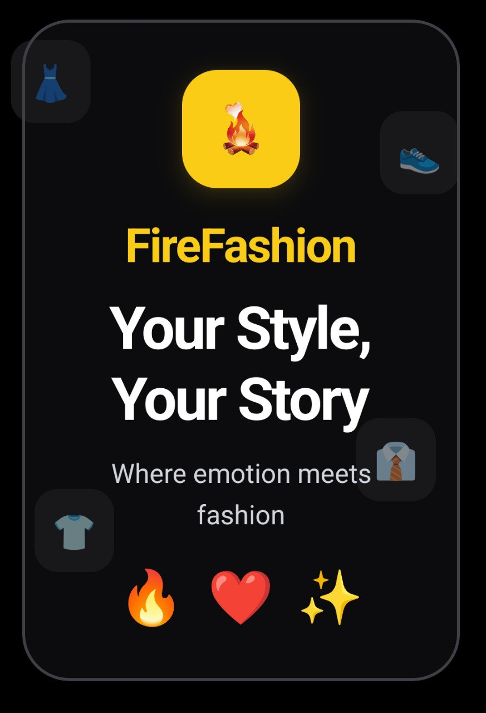
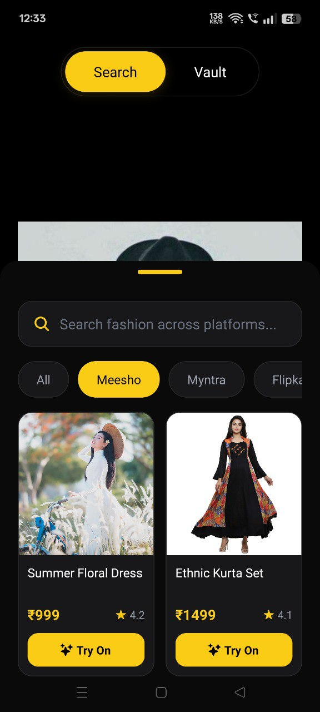
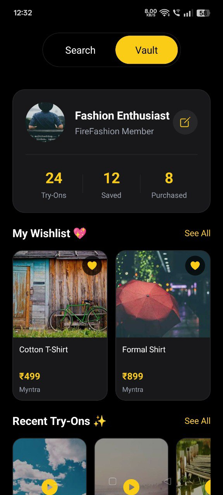

# 🔥 FireFashion

<div align="center">
  

  <p><strong>Your Style, Your Story</strong></p>
  <p>Where emotion meets fashion - AI-powered virtual try-on for smart shopping</p>

  
  
  
</div>

---

## 📱 Screenshots

<table>
  <tr>
    <td></td>
    <td></td>
    <td></td>
  </tr>
</table>

---

## ✨ Features

### 🔍 **Multi-Platform Search**
Search across 5 major e-commerce platforms in one place:
- 🛍️ Meesho
- 👗 Myntra
- 🛒 Flipkart
- 📦 Amazon
- And more coming soon!

### ✨ **AI-Powered Virtual Try-On**
- Upload your photo or take one with the in-app camera
- See how clothes look on you before buying
- Save time and money with virtual fitting

### 💾 **Personal Vault**
- Save your favorite products to wishlist
- Track your recent try-ons
- View your fashion journey stats

### 🎨 **Beautiful UI/UX**
- Instagram story-style onboarding
- Smooth bottom sheet product browser
- Dark theme with yellow accent colors
- Fluid animations and transitions

---

## 🚀 Tech Stack

- **Framework:** React Native with Expo
- **Language:** TypeScript
- **UI Library:** HeroUI Native
- **Navigation:** Expo Router (file-based routing)
- **Animations:** React Native Reanimated
- **State Management:** React Hooks + AsyncStorage
- **Backend:** Supabase
- **Camera:** expo-camera
- **Image Picker:** expo-image-picker
- **Bottom Sheet:** @gorhom/bottom-sheet

---

## 📦 Installation

### Prerequisites
- Node.js 18+ installed
- npm or yarn package manager
- Expo CLI installed globally

### Steps

1. **Clone the repository**
   ```bash
   git clone <repository-url>
   cd fire
   ```

2. **Install dependencies**
   ```bash
   npm install --legacy-peer-deps
   ```

3. **Set up environment variables**
   ```bash
   cp .env.example .env
   # Add your Supabase credentials
   ```

4. **Start the development server**
   ```bash
   npx expo start
   ```

5. **Run on device**
   - Press `a` for Android emulator
   - Press `i` for iOS simulator
   - Scan QR code with Expo Go app on physical device

---

## 🎯 Usage

### First Launch
1. **Onboarding:** Swipe through 5 beautiful slides showcasing app features
2. **Camera Setup:** Upload or capture your photo for virtual try-on
3. **Explore:** Start searching for clothes across multiple platforms

### Main Features

#### Search Tab
- Tap search bar to expand bottom sheet
- Filter by platform (All, Meesho, Myntra, Flipkart, Amazon)
- Browse products with images, prices, and ratings
- Tap any product to try it on

#### Vault Tab
- View your profile with activity stats
- Access your saved wishlist items
- Check recent try-on history
- Tap any item to view details or try again

---

## 🏗️ Project Structure

```
fire/
├── app/                      # Expo Router pages
│   ├── _layout.tsx          # Root layout
│   ├── index.tsx            # Entry point with navigation logic
│   ├── onboarding.tsx       # 5-slide onboarding flow
│   ├── camera.tsx           # Photo capture/upload screen
│   └── home.tsx             # Main app (Search + Vault)
├── components/              # Reusable components
│   └── ToggleTabs.tsx       # Search/Vault tab switcher
├── hooks/                   # Custom React hooks
│   └── useOnboarding.ts     # Onboarding state management
├── assets/                  # Images, fonts, etc.
│   └── images/
│       └── logo.png         # App logo
├── _server/                 # Python backend
│   ├── api_client.py        # Virtual try-on API client
│   └── requirements.txt     # Python dependencies
├── app.json                 # Expo configuration
├── package.json             # Node dependencies
└── tsconfig.json            # TypeScript configuration
```

---

## 🎨 Design Philosophy

FireFashion follows a **minimalist, emotion-first** design approach:

- **Color Palette:** Midnight black (#18181B) with vibrant yellow accents (#FACC15)
- **Typography:** Bold, modern sans-serif with clear hierarchy
- **Interactions:** Smooth animations using Reanimated
- **Layout:** Instagram story-inspired full-screen cards
- **UX:** Gesture-driven navigation with intuitive controls

---

## 🤝 Contributing

Contributions are welcome! Please follow these steps:

1. Fork the repository
2. Create a feature branch (`git checkout -b feature/amazing-feature`)
3. Commit your changes (`git commit -m 'Add amazing feature'`)
4. Push to the branch (`git push origin feature/amazing-feature`)
5. Open a Pull Request

---

## 📝 License

This project is licensed under the MIT License - see the LICENSE file for details.

---

## 🙏 Acknowledgments

- **HeroUI Native** for beautiful React Native components
- **Expo** for amazing development experience
- **SwitchX API** for mock clothing images
- **Anthropic Claude** for development assistance

---

<div align="center">
  <p>Made with 🔥 and ❤️</p>
  <p><strong>FireFashion</strong> - Fashion • Emotion • Growth</p>
</div>
